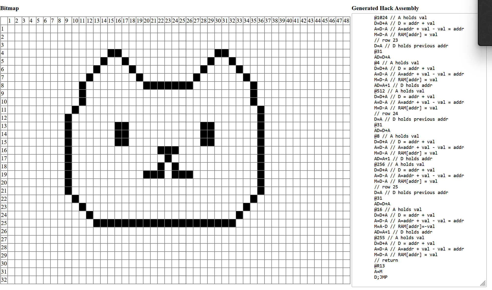

## Código en ensamblador:

```asm
(draw)
	// put bitmap location value in R12
	// put code return address in R13
	@SCREEN
	D=A
	@R12
	AD=D+M
	// row 4
	@192 // A holds val
	D=D+A // D = addr + val
	A=D-A // A=addr + val - val = addr
	M=D-A // RAM[addr] = val
	AD=A+1 // D holds addr
	@96 // A holds val
	D=D+A // D = addr + val
	A=D-A // A=addr + val - val = addr
	M=D-A // RAM[addr] = val
	// row 5
	D=A // D holds previous addr
	@31
	AD=D+A
	@288 // A holds val
	D=D+A // D = addr + val
	A=D-A // A=addr + val - val = addr
	M=D-A // RAM[addr] = val
	AD=A+1 // D holds addr
	@144 // A holds val
	D=D+A // D = addr + val
	A=D-A // A=addr + val - val = addr
	M=D-A // RAM[addr] = val
	// row 6
	D=A // D holds previous addr
	@31
	AD=D+A
	@528 // A holds val
	D=D+A // D = addr + val
	A=D-A // A=addr + val - val = addr
	M=D-A // RAM[addr] = val
	AD=A+1 // D holds addr
	@264 // A holds val
	D=D+A // D = addr + val
	A=D-A // A=addr + val - val = addr
	M=D-A // RAM[addr] = val
	// row 7
	D=A // D holds previous addr
	@31
	AD=D+A
	@1032 // A holds val
	D=D+A // D = addr + val
	A=D-A // A=addr + val - val = addr
	M=D-A // RAM[addr] = val
	AD=A+1 // D holds addr
	@516 // A holds val
	D=D+A // D = addr + val
	A=D-A // A=addr + val - val = addr
	M=D-A // RAM[addr] = val
	// row 8
	D=A // D holds previous addr
	@31
	AD=D+A
	@2044 // A holds val
	D=D+A // D = addr + val
	A=D-A // A=addr + val - val = addr
	M=A-D // RAM[addr]=-val
	AD=A+1 // D holds addr
	@1027 // A holds val
	D=D+A // D = addr + val
	A=D-A // A=addr + val - val = addr
	M=D-A // RAM[addr] = val
	// row 9
	D=A // D holds previous addr
	@31
	AD=D+A
	@4 // A holds val
	D=D+A // D = addr + val
	A=D-A // A=addr + val - val = addr
	M=D-A // RAM[addr] = val
	AD=A+1 // D holds addr
	@1024 // A holds val
	D=D+A // D = addr + val
	A=D-A // A=addr + val - val = addr
	M=D-A // RAM[addr] = val
	// row 10
	D=A // D holds previous addr
	@31
	AD=D+A
	@4 // A holds val
	D=D+A // D = addr + val
	A=D-A // A=addr + val - val = addr
	M=D-A // RAM[addr] = val
	AD=A+1 // D holds addr
	@1024 // A holds val
	D=D+A // D = addr + val
	A=D-A // A=addr + val - val = addr
	M=D-A // RAM[addr] = val
	// row 11
	D=A // D holds previous addr
	@31
	AD=D+A
	@2 // A holds val
	D=D+A // D = addr + val
	A=D-A // A=addr + val - val = addr
	M=D-A // RAM[addr] = val
	AD=A+1 // D holds addr
	@2048 // A holds val
	D=D+A // D = addr + val
	A=D-A // A=addr + val - val = addr
	M=D-A // RAM[addr] = val
	// row 12
	D=A // D holds previous addr
	@31
	AD=D+A
	M=1
	AD=A+1 // D holds addr
	@2048 // A holds val
	D=D+A // D = addr + val
	A=D-A // A=addr + val - val = addr
	M=D-A // RAM[addr] = val
	// row 13
	D=A // D holds previous addr
	@31
	AD=D+A
	@385 // A holds val
	D=D+A // D = addr + val
	A=D-A // A=addr + val - val = addr
	M=D-A // RAM[addr] = val
	AD=A+1 // D holds addr
	@2072 // A holds val
	D=D+A // D = addr + val
	A=D-A // A=addr + val - val = addr
	M=D-A // RAM[addr] = val
	// row 14
	D=A // D holds previous addr
	@31
	AD=D+A
	@385 // A holds val
	D=D+A // D = addr + val
	A=D-A // A=addr + val - val = addr
	M=D-A // RAM[addr] = val
	AD=A+1 // D holds addr
	@2072 // A holds val
	D=D+A // D = addr + val
	A=D-A // A=addr + val - val = addr
	M=D-A // RAM[addr] = val
	// row 15
	D=A // D holds previous addr
	@31
	AD=D+A
	@385 // A holds val
	D=D+A // D = addr + val
	A=D-A // A=addr + val - val = addr
	M=D-A // RAM[addr] = val
	AD=A+1 // D holds addr
	@2072 // A holds val
	D=D+A // D = addr + val
	A=D-A // A=addr + val - val = addr
	M=D-A // RAM[addr] = val
	// row 16
	D=A // D holds previous addr
	@31
	AD=D+A
	@8191 // A holds val
	D=D+A // D = addr + val
	A=D-A // A=addr + val - val = addr
	M=A-D // RAM[addr]=-val
	AD=A+1 // D holds addr
	@2048 // A holds val
	D=D+A // D = addr + val
	A=D-A // A=addr + val - val = addr
	M=D-A // RAM[addr] = val
	// row 17
	D=A // D holds previous addr
	@31
	AD=D+A
	@16385 // A holds val
	D=D+A // D = addr + val
	A=D-A // A=addr + val - val = addr
	M=D-A // RAM[addr] = val
	AD=A+1 // D holds addr
	@2048 // A holds val
	D=D+A // D = addr + val
	A=D-A // A=addr + val - val = addr
	M=D-A // RAM[addr] = val
	// row 18
	D=A // D holds previous addr
	@31
	AD=D+A
	@24575 // A holds val
	D=D+A // D = addr + val
	A=D-A // A=addr + val - val = addr
	M=A-D // RAM[addr]=-val
	AD=A+1 // D holds addr
	@2048 // A holds val
	D=D+A // D = addr + val
	A=D-A // A=addr + val - val = addr
	M=D-A // RAM[addr] = val
	// row 19
	D=A // D holds previous addr
	@31
	AD=D+A
	@18431 // A holds val
	D=D+A // D = addr + val
	A=D-A // A=addr + val - val = addr
	M=A-D // RAM[addr]=-val
	AD=A+1 // D holds addr
	@2051 // A holds val
	D=D+A // D = addr + val
	A=D-A // A=addr + val - val = addr
	M=D-A // RAM[addr] = val
	// row 20
	D=A // D holds previous addr
	@31
	AD=D+A
	M=1
	AD=A+1 // D holds addr
	@2048 // A holds val
	D=D+A // D = addr + val
	A=D-A // A=addr + val - val = addr
	M=D-A // RAM[addr] = val
	// row 21
	D=A // D holds previous addr
	@31
	AD=D+A
	M=1
	AD=A+1 // D holds addr
	@2048 // A holds val
	D=D+A // D = addr + val
	A=D-A // A=addr + val - val = addr
	M=D-A // RAM[addr] = val
	// row 22
	D=A // D holds previous addr
	@31
	AD=D+A
	@2 // A holds val
	D=D+A // D = addr + val
	A=D-A // A=addr + val - val = addr
	M=D-A // RAM[addr] = val
	AD=A+1 // D holds addr
	@1024 // A holds val
	D=D+A // D = addr + val
	A=D-A // A=addr + val - val = addr
	M=D-A // RAM[addr] = val
	// row 23
	D=A // D holds previous addr
	@31
	AD=D+A
	@4 // A holds val
	D=D+A // D = addr + val
	A=D-A // A=addr + val - val = addr
	M=D-A // RAM[addr] = val
	AD=A+1 // D holds addr
	@512 // A holds val
	D=D+A // D = addr + val
	A=D-A // A=addr + val - val = addr
	M=D-A // RAM[addr] = val
	// row 24
	D=A // D holds previous addr
	@31
	AD=D+A
	@8 // A holds val
	D=D+A // D = addr + val
	A=D-A // A=addr + val - val = addr
	M=D-A // RAM[addr] = val
	AD=A+1 // D holds addr
	@256 // A holds val
	D=D+A // D = addr + val
	A=D-A // A=addr + val - val = addr
	M=D-A // RAM[addr] = val
	// row 25
	D=A // D holds previous addr
	@31
	AD=D+A
	@16 // A holds val
	D=D+A // D = addr + val
	A=D-A // A=addr + val - val = addr
	M=A-D // RAM[addr]=-val
	AD=A+1 // D holds addr
	@255 // A holds val
	D=D+A // D = addr + val
	A=D-A // A=addr + val - val = addr
	M=D-A // RAM[addr] = val
	// return
	@R13
	A=M
	D;JMP
```
## Capturas:

[Bitmap de Actividad 18 ](capturas) 
